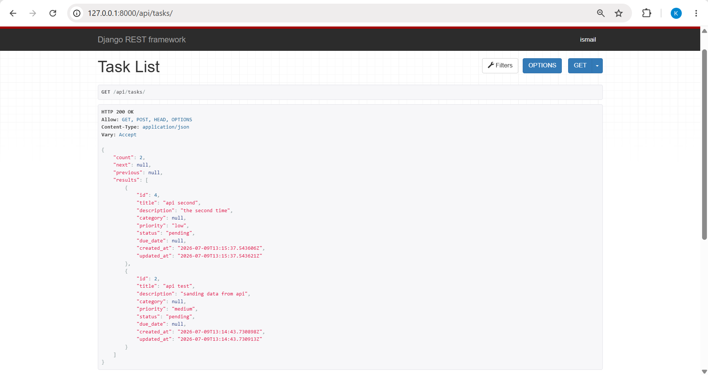
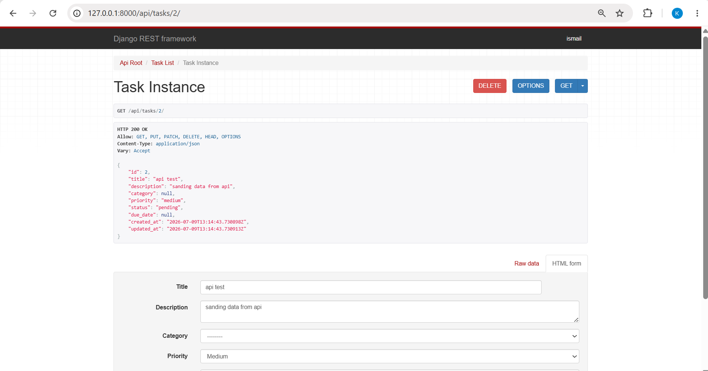
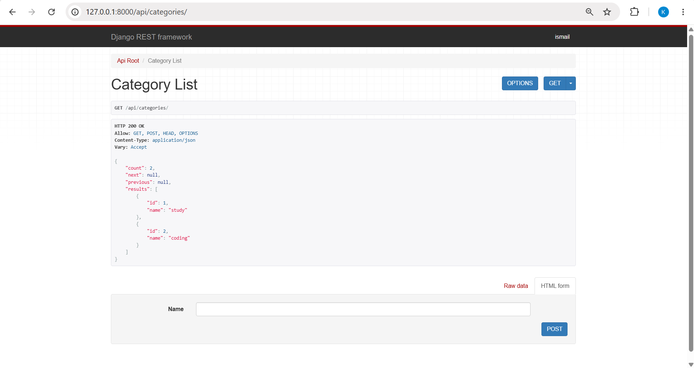
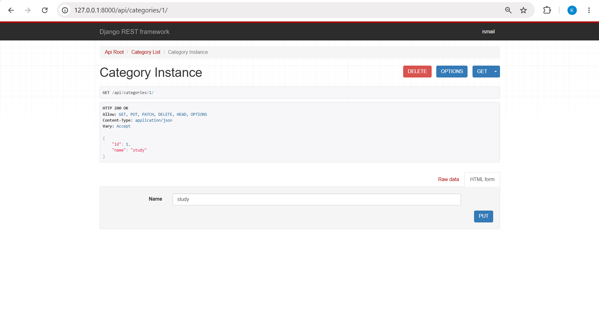

# Django Task Management System

A simple Task Management System built with **Django**, **Django REST Framework**, and **PostgreSQL**.

This project was created to practice backend development using Django while combining both traditional Django views and REST APIs in a single application.


---

# Features

## Authentication

* User Registration
* User Login
* User Logout

---

## Task Management

Users can:

* Create tasks
* View their own tasks
* Update tasks
* Delete tasks
* Toggle task status
* Assign priorities
* Set due dates

Each user can only access their own data.

---

## Category Management

Category CRUD is implemented through the REST API.

There is **no Category management interface in the web UI.**

---

## REST API

The project includes a complete REST API built with Django REST Framework.

API features include:

* Category CRUD
* Task CRUD
* Filtering
* Searching
* Ordering
* Session Authentication
* User-based data isolation

---

# Technologies Used

* Python
* Django
* Django REST Framework (DRF)
* PostgreSQL
* HTML
* Bootstrap

---

# Project Structure

```
todo_project/
├── manage.py
├── requirements.txt
├── .gitignore
├── README.md
├── todo_project/
│   ├── settings.py
│   ├── urls.py
│   ├── wsgi.py
│   └── asgi.py
├── templates/
│   └── base.html
├── accounts/
│   ├── apps.py
│   ├── forms.py
│   ├── views.py
│   ├── urls.py
│   └── templates/accounts/
│       ├── login.html
│       └── register.html
└── tasks/
    ├── apps.py
    ├── models.py
    ├── admin.py
    ├── forms.py
    ├── views.py
    ├── urls.py
    ├── serializers.py
    ├── permissions.py
    ├── api_views.py
    ├── api_urls.py
    └── templates/tasks/
        ├── task_list.html
        └── task_form.html
```

---

# API Features

## Tasks

* Create Task
* Retrieve Task
* Update Task
* Delete Task

### Filtering

Example:

```
/api/tasks/?status=pending
```

```
/api/tasks/?priority=high
```

```
/api/tasks/?category=1
```

### Searching

```
/api/tasks/?search=meeting
```

Search is available on:

* title
* description

### Ordering

```
/api/tasks/?ordering=created_at
```

```
/api/tasks/?ordering=-created_at
```

```
/api/tasks/?ordering=due_date
```

---

# User Interface

The web interface provides basic functionality for:

* Login
* Registration
* Task List
* Create Task
* Update Task
* Delete Task
* Toggle Status

> **Note:** The frontend UI is intentionally minimal. The primary focus of this project is backend development and REST API implementation rather than frontend design.

**image1**

    

**image2**

    


**image3**

    

**image4**

    

**image5**

    


---

# Database

PostgreSQL is used as the primary database.

---

# Installation

## Clone Repository

```bash
git clone https://github.com/ismailCrafts/Todo_withAPI_Project.git
```

```bash
cd your-repository
```

---

## Create Virtual Environment

```bash
python -m venv venv
```

Windows

```bash
venv\Scripts\activate
```

Linux/macOS

```bash
source venv/bin/activate
```

---

## Install Dependencies

```bash
pip install -r requirements.txt
```

---

## Configure Database

Update your PostgreSQL credentials in:

```
settings.py
```

---

## Apply Migrations

```bash
python manage.py makemigrations
python manage.py migrate
```

---

## Create Superuser

```bash
python manage.py createsuperuser
```

---

## Run Development Server

```bash
python manage.py runserver
```

Open:

```
http://127.0.0.1:8000/
```

---

# Future Improvements

* JWT Authentication
* API Documentation (Swagger/OpenAPI)
* Better Frontend UI
* Responsive Design
* User Profile
* Email Verification
* Docker Support
* Unit Tests

---

# Learning Purpose

This project was developed to strengthen backend development skills using Django and Django REST Framework. It demonstrates CRUD operations, authentication, REST APIs, pagination, filtering, searching, ordering, and PostgreSQL integration.

---

# Author

**MD ISMAIL**

Junior Backend Developer

Python • Django • Django REST Framework • PostgreSQL
